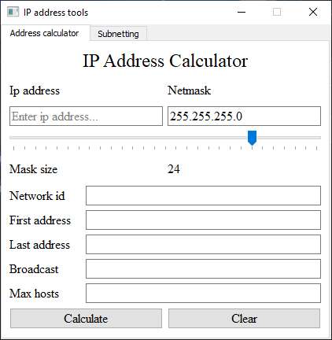
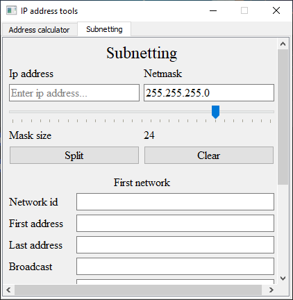

# IpTools

Small app that calculates:
 *  the network id
 * first available address 
 * last available address
 * broadcast address 
 for a given ip address and its mask.

 It can also do simple subnetting calculations, such as split a network.

